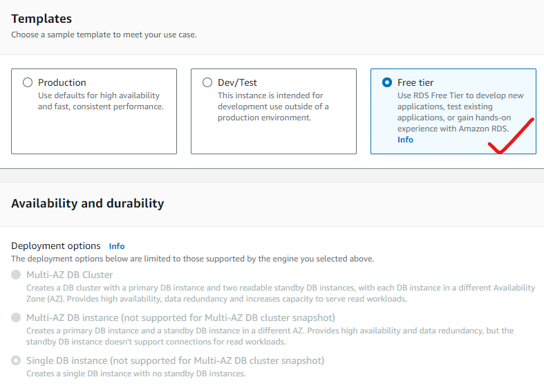

# Data Base

### What is Database?
* **A database is an organized collection of structured information, or data, typically stored electronically in a computer system.** A database is usually controlled by a database management system (DBMS). Together, the data and the DBMS, along with the applications that are associated with them, are referred to as a database system, often shortened to just database.

### Why Database?
* **Database software makes data management simpler by enabling users to store data in a structured form and then access it.** It typically has a graphical interface to help create and manage the data and, in some cases, users can construct their own databases by using database software.

### When we need Database?
* **Databases are used to store and manage large amounts of structured and unstructured data,** and they can be used to support a wide range of activities, including data storage, data analysis, and data management. 

### Web Application Architecture
* The web app architecture diagram **provides a logical representation of how users will interact with the app** and how the internal parts of the app will function.

## What are the Databases services provided by AWS?

* AWs was providing these many services.

### AWS RDS
* AWS RDS (Relational Database Service) is database a service offering from AWS which allows us to run [Refer here](https://aws.amazon.com/rds/)
* [Refer here](https://docs.aws.amazon.com/AmazonRDS/latest/UserGuide/Welcome.html)

* Lets create our first database

    * Choose a database creation method.
    1. **Standard create**
    
    * Engine Options
        * Engine type
        
        * Engine version
        
    * Templates
        * Production
        
        * Dev/Test
        
        * Free tier
        
    * Settings
        * DB instance identifer
            * We need to give name for the DB instance
        * Credentials Settings
            * Master username
            * Credentials management
            * Master password
        
        
    * Instance configuration
    
        * Standard Classes
            * Standard instances provide a balance of compute, memory, and network resources. They are a good choice for many database workloads.
        * Memory optimized classes
            * Memory optimized instances accelerate performance for workloads that process large data sets in memory.
        * Burstable classes
            * Burstable performance instances provide a baseline level of CPU performance with the ability to burst above the baseline.
    * Storage
    
        * Storage type
        
        * Allocated storage
        * Storage autoscaling
    * Connectivity
    
    
    
        * RDS Proxy
            * RDS Proxy allows your applications to pool and share database connections to help them scale. An RDS proxy simplifies connection management and makes applications more resilient to database failures.
    * Tags
    * Database authentication
    
        * Password authentication
            * Manage your database user credentials through your DB engine's native password authentication features.
        * Password and IAM database authentication
            * Manage your database user credentials through your DB engine's native password authentication features and IAM users and roles.
        * Password and Kerberos authentication
            * Manage your database user credentials through your DB engine's native password authentication features and an AWS Managed Microsoft AD created with AWS Directory Service.
    * Monitoring
    
    * Additional configuration
    
    
    
    
    

    2. **Easy create**
        * Use recommended best-practice configurations. Some configuration options can be changed after the database is created.
    
    * Configure
        * Engine type
        
        * Edition
        * DB instance size
        
        * DB instance identifier
        
    * Set up ec2 connection
    
    * View default settings for easy create
    
    

* Creating the AWS RDS Instance

### If you need connect to you AWS RDS Instance [Refer here](https://directdevops.blog/2022/12/09/aws-classroomnotes-09-dec-2022/) 
* (or)
### Go through this video [Refer here](https://youtu.be/ypWzL3PdKx0?si=TgjOCoc9EeU8_W6b)

## Developers usage
* Adding an Amazon RDS DB instance to your **Java application environment**[Refer here](https://docs.aws.amazon.com/elasticbeanstalk/latest/dg/java-rds.html)

* Adding an Amazon RDS DB instance to your **Python application environment**
[Refer here](https://docs.aws.amazon.com/elasticbeanstalk/latest/dg/create-deploy-python-rds.html)

* Adding an Amazon RDS DB instance to your **.NET application environment**
[Refer here](https://docs.aws.amazon.com/elasticbeanstalk/latest/dg/create_deploy_NET.rds.html)